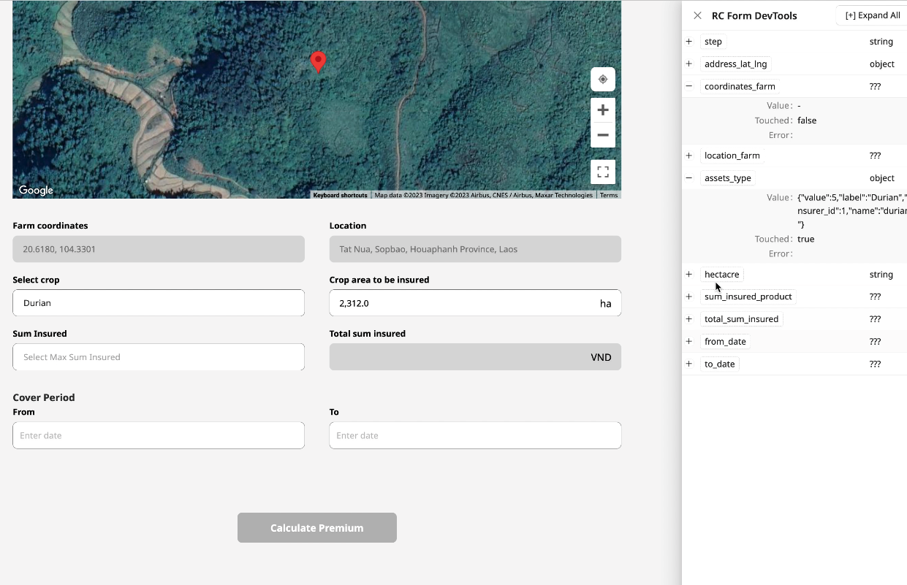

# DevTools for RC Forms

A Powerfull DevTools to help debug RC Forms.



## Install

```bash
npm install rc-form-devtools -D
```

## Usage

```diff
import React from 'react';

import Form, { Field, useForm } from 'rc-field-form';
import { DevTool } from 'rc-form-devtools';

const App = () => {
  const [form] = useForm();

  return (
    <>
      <Form form={form} name="userinfo" onFinish={console.log}>
        <Form.Item label="Username" name="username">
          <Input />
        </Form.Item>

        <Form.Item label="Age" name="age">
          <InputNumber min="0" max="100" />
        </Form.Item>

        <Form.Item>
          <Button type="primary" htmlType="submit">
            Submit
          </Button>
        </Form.Item>

      </Form>
+     <DevTool form={form}/>
    </>
  );
};

export default App;
```
